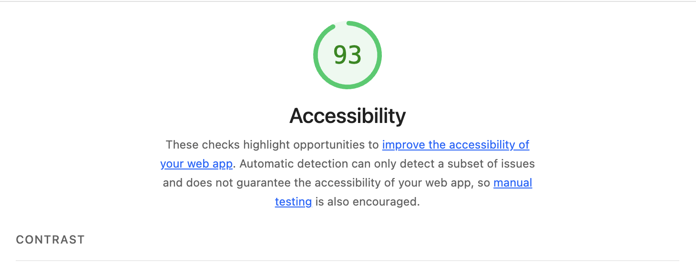

# Web Tasarimi ve Programlama - LAB 2

Bu proje, LAB-2 kapsaminda semantik HTML5, erisilebilirlik (a11y) ve form yapilari kullanilarak gelistirilmis kisisel portfoy sayfasidir.

---

## Proje Amaci

- Semantik HTML etiketlerini dogru kullanmak
- Erişilebilirlik (Accessibility) kurallarini uygulamak
- Label–input iliskisini dogru kurmak
- ARIA ozelliklerini kullanmak
- Lighthouse ile 90+ Accessibility skoru almak

---

## Kullanilan Teknolojiler

- React (TypeScript)
- Semantic HTML5
- ARIA attributes
- Accessible Form Yapisi
- Lighthouse Testi

---

## Sayfa Bolumleri

- Header ve Navigasyon
- Hakkimda Bolumu (figure + alt metin)
- Projelerim (article yapisi)
- Iletisim Formu (label + aria-describedby + role="alert")
- Footer

---

## Lighthouse Sonucu

Proje Google Lighthouse ile test edilmistir.

### Accessibility Skoru: **93 / 100 ✅**

- Performance: 89
- Accessibility: 93
- Best Practices: 96
- SEO: 83

---

## Git Commit Yapisi

- feat: add semantic HTML portfolio structure
- feat: add accessible contact form with labels and aria
- fix: improve accessibility based on Lighthouse report
- docs: add Lighthouse accessibility report screenshot

---

## Sonuc

Accessibility 90+ hedefi basariyla saglanmistir ve LAB gereksinimleri karsilanmistir.